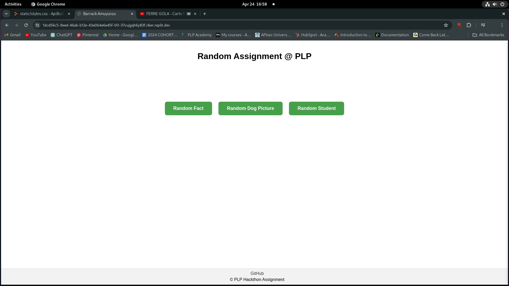
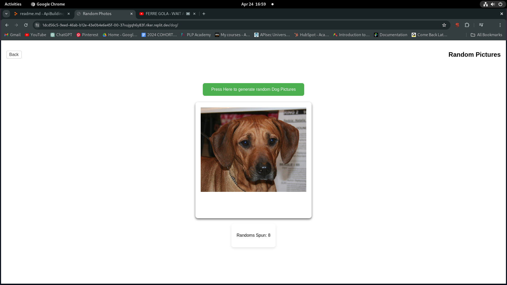

## Hackathon Instructions

Make sure to use the comments in the files to complete the hackathon

## Structure of the Assignment
It contains [5] pages  

    <>[Error.html] ---->this is a error fallback page such that when we cant fetch the desired page we fall back to this page.  
    
    <>[ Index.html ] --->this is the core page of this project with buttons to Navigate to differet pages.  
    
    <>[Randomfact.html] --->This page Display our **fact quote** together with a **button** to **generate random fact** and a{ **count card** }which shows the number of time we have generated our **facts**.  
    
    <> [Randompic.html]  ---> This Display our Random image card with a button to generate different our pctures and at the bottom is a cout card to keep track of the number of time weve generated.  
    
    <> [Randomstudent.html] ---> Our last page which displays a card of student details displayed at random.It alse have a generate button and a count card to keep track of number of time we generated.

#Screenshot of the the Index page <COREPAGE/>

#Screenshot of the the random dog page <Random Dog/>

#Screenshot of the the random dog page <Random Dog/>
